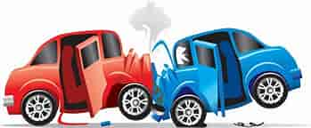
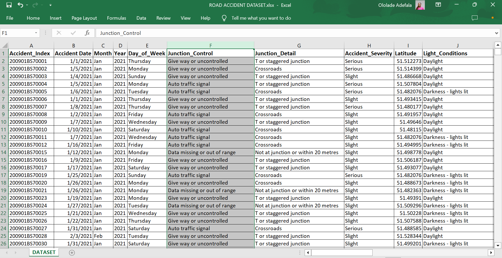
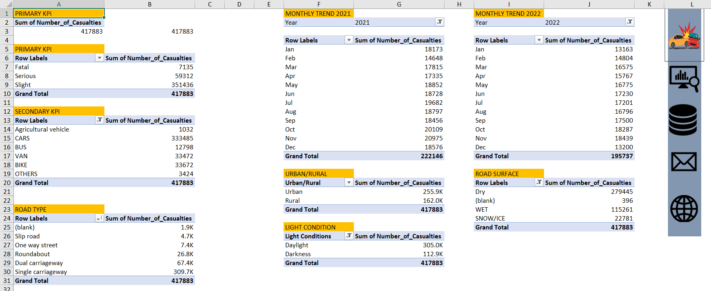

# ROAD-ACCIDENT-ANALYSIS

***
## INTRODUCTION
This Road Accident Data Analysis project was created using Microsoft Excel. An interactive dashboard was created using some Key Performance Indicators (KPIs) to help gain insights into road accident. It provides valuable insights and visualizations based on road accident data for the years 2021 and 2022.

## PROBLEM STATEMENT
Road accidents are one among the world's leading causes of disabilities and fatalities. The main concern of this road accident data analysis is to identify the key factors causing the road accident and the accident severity.
## SKILLS
- Data Cleaning
- Data Analysis
- Data Visualization
## KEY PERFORMANCE INDICATORS/OTHER FACTORS

### KEY INSIGHTS
Based on the analysis of the road accident data, the following key insights were obtained:

- _Total number of casualties is **417,883**_
- _The vehicle type with the highest number of casualties is _**CAR**_, amounting to 79.8% (333,485) of the total casualties_
- _The total number of casualties for the year 2021 is **222,146**, while year 2022 is **195,737**_
- _**November 2021** had the highest number of casualties, while February 2021 had the lowest_. _Similarly, **November 2022** had the highest number of casualties, and January 2022 had the lowest_

**You can preview the Road Accident Analysis dashboard [here](https://roadaccidentdashboard/) to gain further insights into the Road Accident Analysis**

## CONCLUSION/RECOMMENDATION
The number of car accidents increases every November according to the trend in both year 2021 and 2022. All these insights provides a broad understanding of the road accident data and can be used to inform decision-making and implement strategies for improving road safety. 

Based on the useful insights derived from this road accident analysis, these stakeholders such as, Ministry of Road Transportation, Road Safety Corps etc. needs to put adequate measures in place such as New policies, Regulations and Standard Operating Procedures, especially for car maintenance to be done yearly or quarterly by their users. Not ruling out road constructors too.
